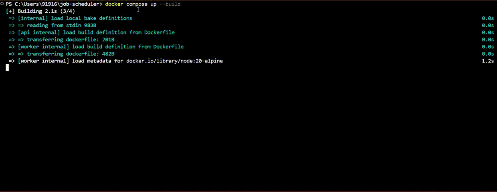

# 🚀 ReTraced — Distributed Job Scheduler (Redis + Node.js)
 
[](https://nodejs.org/)
[](https://www.typescriptlang.org/)
[](https://expressjs.com/)
[](https://redis.io/)
[](https://www.docker.com/)

[](https://opensource.org/licenses/MIT)
[](http://makeapullrequest.com)
[](https://github.com/Anshikakalpana/job-scheduler/graphs/commit-activity)

**ReTraced** is a Dockerized **distributed job scheduler** built with  
**Node.js + TypeScript + Redis**, focused on **reliability, retries, DLQ, and observability**.

> ✅ _ReTraced tells the lifecycle story of every job it schedules — from execution to retries to DLQ._

---

## 🎬 Demo



---

## ✨ Highlights (Strengths)

✅ What makes ReTraced strong:

- **Redis-backed distributed queueing**
- **At-least-once delivery** using `BRPOPLPUSH`
- **Delayed jobs** using Redis **ZSET**
- **Retry strategies**: Exponential / Fixed / Linear / Three-tier
- **Dead Letter Queue (DLQ)** for poison jobs + manual debugging
- **Visibility timeout** + stuck job recovery watchdog
- **Job metadata + history** (observability-first approach)
- **Dockerized setup** (API + Worker + Redis)
- **TypeScript type-safety** end-to-end
- **Unit + Integration tests** with Jest

---

## 📚 Documentation Links


-    **Documentation*** : [Documentation →](https://re-trace-five.vercel.app/)
- 🏗️ **Architecture**: [Read Architecture →](https://re-trace-five.vercel.app/docs/2Architecture)
- ⚠️ **Limitations**: [Read Limitations →](https://re-trace-five.vercel.app/docs/5Limitations)
- 🔁 **Retries & Backoff**: [Retry Design →](https://re-trace-five.vercel.app/docs/4Retry)
- 🧪 **Technical Model**: [Technical Model →](https://re-trace-five.vercel.app/docs/3technical)
- 🆚 **Comparison**: [ReTraced vs BullMQ / Sidekiq / Others →](https://re-trace-five.vercel.app/docs/6Comparison)

---

## 🧩 System Overview

### Core Components

- **API Service**
  - Creates jobs
  - Stores job metadata
  - Pushes job IDs into Redis `ready` queue

- **Worker Service**
  - Consumes jobs from Redis
  - Executes handler (webhook / job processor)
  - Retries on transient failures
  - Moves permanent failures to DLQ

- **Redis**
  - `ready` → jobs waiting to execute
  - `processing` → jobs currently being executed
  - `delayed` (ZSET) → scheduled retries / delayed jobs
  - `dlq` → permanently failed jobs

---

## 🔁 Retry Strategy (Three-Tier)

ReTraced supports a **three-tier retry model**:

1. **Immediate retry** (short transient failures)
2. **Backoff retry** (exponential / fixed / linear)
3. **DLQ fallback** after max tries

---


## 🐳 Quick Start (Run Locally)

###  Clone

```bash
git clone https://github.com/Anshikakalpana/job-scheduler

docker compose up --build      ( for one worker )

docker compose up --scale worker=5    ( for multiple workers )


📩 Enqueue Test Jobs

docker compose exec worker node dist/handlers/email.handler.js

docker compose exec redis redis-cli

GET job:job-0


```

## Roadmap

- Multiple worker replicas (horizontal scaling)
- Job prioritization
- Cron / scheduled jobs
- Rate limiting per job type
- Job cancellation + pause/resume queues
- Prometheus / Grafana metrics
- Distributed tracing (OpenTelemetry)
- Lua scripts for fully atomic Redis operations
- PostgreSQL persistence for long-term storage


## 📄 License

MIT License — free for personal & commercial use.

---

## 🤝 Contributing

Contributions, issues, and feature requests are welcome!  
Feel free to check the [issues page](https://github.com/Anshikakalpana/job-scheduler/issues).

**Guidelines** 

- Fork the repository
- Create your feature branch (git checkout -b feature/amazing-feature)
- Commit your changes (git commit -m 'Add some amazing feature')
- Push to the branch (git push origin feature/amazing-feature)
- Open a Pull Request


---

## ⭐ Show Your Support

Give a ⭐️ if this project helped you!

---


